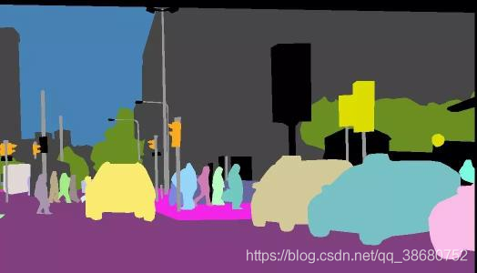
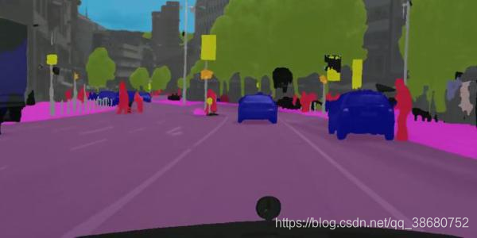

# 图像分割

##  图像分割
- 提取图像中哪些像素是用于表述已知目标的目标种类与数量问题、目标尺度问题、外在环境干扰问题、物体边缘等，目前分为语义分割、实例分割、全景分割。

### Semantic Segmentation（语义分割）
- 把图像中每个像素赋予一个类别标签（比如汽车、人、建筑、地面、天空、树等）

- 如下图就把图像分为了人（红色）、树木（深绿）、汽车（蓝色）、天空（浅蓝）等标签，用不同的颜色来表示。

### Instance Segmentation（实例分割）

- 实例分割是目标检测和语义分割的结合，只对图像中的目标进行检测，并对检测到的目标进行分割。相对目标检测的边界框，实例分割可以精确到物体的边缘信息，相对语义分割，实例分割需要标注出图像上同一物体的不同个体。比如用不同的颜色区别车等。

### Panorama Segmentation（全景分割）
- 全景分割是语义分割和实例分割的结合，对图像中所有物体和背景都要进行检测和分割。也就是不仅要对感兴趣的目标区域进行分割，而且也要对背景区域进行分割。背景区域的分割属于语义分割，而物体的分割属于实例分割。
- 与语义分割相比，全景分割的困难在于要优化全连接网络的设计，使其网络结构能够区分不同类别的实例;
- 与实例分割相比，由于全景分割要求每个像素只能有一个类别和id标注，因此不能出现实例分割中的重叠现象。
- 如下图，把图像的目标和背景都分成了不同的颜色
