[TOC]

# 图像去噪

​	图像噪声产生原因：

​	1、图像获取过程中：由于受传感器材料属性、工作环境、电子元器件和电路结构等影响，会引入各种噪声。如电阻引起的热噪声、场效应管的沟道热噪声、光子噪声、暗电流噪声、光响应非均匀性噪声。

​	2、信号传输过程中：由于传输介质和记录设备等的不完善，数字图像在其传输记录过程中往往会受到多种噪声的污染。另外，在图像处理的某些环节当输入的对象并不如预想时也会在结果图像中引入噪声。

​	图像去噪是计算机视觉领域的传统方向，对于可见光图像、视频、核磁图像等的处理仍应用广泛，在工业和学术界引起很多人的关注。噪声的种类包括很多种，种类也各不相同，比如椒盐噪声、高斯噪声等。

​	噪声包括两种方式，一种称之为加性噪声，一种称之为乘性噪声。eg设置带噪声的图像为$`{noise}_{img}(x,y)`$，x，y表示像素位置。

​	则加法性质的噪声图可以表示为

​	$`{noise}_{img}(x,y)={clear}_{img}(x,y)+{noise}(x,y)`$

​	则乘性性质的噪声图可以表示为

​	$`{noise}_{img}(x,y)={clear}_{img}(x,y)+n*{clear}_{img}(x,y) ，n为一个数值 `$

​	图像中的噪声许多以高斯噪声$`N(μ,σ^2)`$近似表示，其中$`μ=0`$，$`σ^2`$是噪声的方差，方差越大，噪声越大。一个有效的去除高斯噪声的方式就是图像求平均，对N幅相同的图像求平均的结果将使得高斯噪声的方差降低到原来的N分之一。

​	基于BM3D(block-matching 3D ，2007)框架的系列算法是该领域的著名方法，其结合图像非局部相似的属性和变换域的稀疏表示。	

## 相关博客与视频地址

​	[博客1](https://zhuanlan.zhihu.com/p/282742535)、[博客2](https://github.com/ZhaomingKong/Denoising-Comparison)、[视频NR](https://www.bilibili.com/video/BV1Mv411u74D)、[【北交】图像处理与机器学习](https://www.bilibili.com/video/BV1Kh411X7Qv)

## 论文名

​	从论文**A Comprehensive Comparison of Multi-Dimensional Image Denoising Methods**伊始了解图像去噪算法，这篇论文考察了191篇论文，对传统的图像去噪方法和深度学习方法进行了综述和比较，对比包括图片和视频。

## 论文结论

- 1、传统算法BM3D系列算法在性能和效果有不错的表现
- 2、对于仅从噪声观察中学习的传统降噪器，改进的奇异值分解（M-SVD）方法能够与许多基于张量的方法产生相似的效果；简言之，使用张量不会提升性能
- 3、基于DNN的方法虽然在合成数据集上训练（标签数据在实际场景是不存在的，只能采用合成噪声），但在实际测试中仍然表现出强大的泛化能力。

## 论文详解

​	图像去噪旨在给定噪声图像恢复原图像，在噪声模型难以估计的情况下，利用图像的 NLSS（非局部自相似） 属性成为方法的主流。自然图像内部也含有相似的图像块，利用此特点恢复源图像。

### 基于传统去噪方法及应用

​	传统的图像去噪方法主要从空间域去噪（均值滤波、中值滤波、高斯滤波、双边滤波、NLM算法等）和变换域去噪（低通滤波、高通滤波、带阻（通）滤波器、小波萎缩法等）

​	将空间域和变换域结合的降噪方案就是非局部均值算法，eg：NL-Means

​	####NL-Means 介绍 begin ####

​	充分利用自然图像的“空间相似性”，将图像分成一个个的小块，在以图像为单位对图像进行降噪。

​		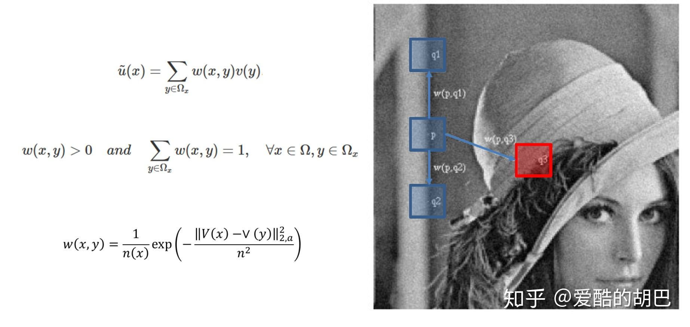

​	假设我们取11*11的窗口作为处理的小图像块，我们在图像上选取几个类似的图像斑块，例如上述的q1、q2和q3，但是q1和q2明显比q3近一点，根据空间相似性我们很容易知道q1q2应该和p更为相似，故我们在对P图像斑块进行处理的时候，我们可以对q1q2q3分别赋予不同的权重，再把他们“摞起来”，求个加权平均，这样就对P图像斑块完成了降噪的过程，类似一个基于大斑块的高斯滤波算法。

​	当邻域相似时,方差就小,权重就大,而差异很大时方差就很大,权重就很小,满足了算法的需求.

​#### NL-Means 介绍 end ####

​	传统图像去噪方法（成功的[BM3D](#3)框架的众多方法）流程：

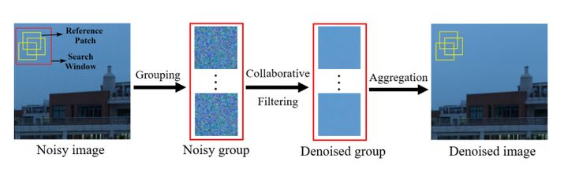

​	即噪声图像经过**分组 Grouping**、**协同过滤 Collaborative filtering**、**聚合 Aggregation**，得到结果图像。

### 基于DNN去噪方法及应用：

​	最简单的只具有三个卷积层的简单CNN去噪框架图解：

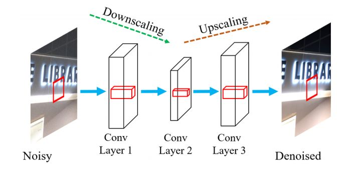

### 论文对传统方案和DNN方式的一些实验结果

​	实验结果此处就详细copy了，详情见[地址](https://zhuanlan.zhihu.com/p/282742535)	

​	实验 包括

- 传统方法和基于DNN的方法在几个**真实彩色图像数据集**上的结果，以 PSNR 和 SSIM 为评价指标
- 多个方法在真实彩色视频数据集上的评比详细结果
- 视觉评估 CC15 数据集(PSNR)
- 视觉评估 PolyU 数据集(PSNR)
- 视觉评估 IOCI’s IPHONE 5S 数据集(PSNR)
- 视觉评估 IOCV 数据集（彩色视频去噪）
- 人为评分实验：FastDVDNet算法在计算量较低的前提下，效果表现也一致的好。
- 张量的去噪器的比较结果：使用张量并不能提高
- 真实世界 HHD 数据集上，MSI 去噪方法比较结果
- 在估计噪声水平σ = 19% 的合成Brainweb T1w 数据上对比较方法进行可视化评估

# 附

## ISP去噪

### 均值滤波

​	**均值滤波器**可提取感兴趣物体，去除噪声、边缘模糊；

#### 一维离散系统:均值滤波器

- $`h[k]={1,1,1}`$ # 权重

 eg：某一维信号取值如 {0 0 0 6 0 0 0 0 0 2 2 2 2 ….}, 用3点平均滤波器对其滤波，求滤波后信号

​		均值滤波结果为{0 2 2 2 0 0 0 2/3 4/3 2 2 2 ....}，讲解 222 便是抑制噪声，2/3 4/3 2则是边缘模糊

#### 二维离散系统:均值滤波器

- $`h(m, n)=\left[\begin{array}{lll}1 & 1 & 1 \\ 1 & 1 & 1 \\ 1 & 1 & 1\end{array}\right]`$

 输入图像像素及周边8个点灰度级的平均值图像均值滤波器

 $`y(j,i)=\frac{1}{9} \sum_{m=-1}^{1} \sum_{n=-1}^{1} x(j+m, i+n)`$

 场景应用

1、采用多张同一场景图取平均达到降噪效果，例如星空照片，行星照片。（多次取均值，使得信号接近于真实信号）

2、一张图中取平均达到降噪效果，假设图像在很小邻域范围内像素不会变化很大，一定领域内求平均。

#### 结果缺陷

​	将损失图像的边缘细节。

### 中值滤波

- 邻域内像素(包括原像素)灰度排序,取中间值

 eg：某一维信号取值如 {0 0 0 6 0 0 0 0 0 2 2 2 2 ….}, 用3点中值滤波器对其滤波，求滤波后信号

		中值滤波结果为{0 0 0 0 0 0 0 0 0 2 2 2 2 ....}，前面取掉6 便是抑制噪声，0 0 2则是保留边缘

- 中值滤波器能够使突出的亮(暗)点更接近它周边的点,消除孤立的亮点或者暗点;
- 去除噪声的同时,比较好地保留边缘
- 能够有效去除脉冲噪声(黑白点叠加在图像上)

中值滤波器与均值滤波器的比较：在均值滤波器中，由于噪声成分被放入平均计算中，所以输出受到了噪声的影响，但是在中值滤波器中，由于噪声成分很难选上，所以几乎不会影响到输出。因此同样用3x3区域进行处理，中值滤波消除的噪声能力更胜一筹。中值滤波无论是在消除噪声还是保存边缘方面都是一个不错的方法。

 #### 多级中值滤波

​	多级级联的方式，现在窗口定义一个“+”和“×”形的窗口，分别求出两个窗口的中位值，再结合窗口中心点，选出三个值中间的中位值作为滤波的结果。

​	RAW需要修改的就是窗口设置为5X5，然后在做滤波的时候需要区分G和RB通道，RAW图中的RGB分布是不均匀的，G占50%，R和B各占25%。如下图左侧就是针对G通道的滤波器，右侧是R和B通道的滤波器，都是定义了一个’+'和’X’形的窗口，不同的只是取的点的位置不同。

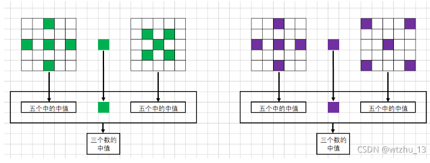

#### 多级中值混合滤波

#####  算法流程

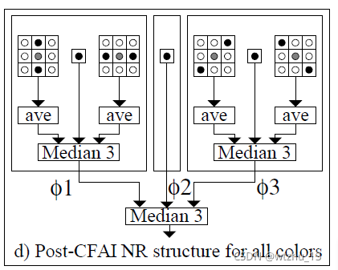

1. 求出竖直方向相邻三个点的均值和水平方向相邻三个点的均值，再结合当前点，用这三个点再求一个中位值；

2. 求出45°和135°方向上的均值，然后结合当前点求出一个中位值；

3. 两个中位值结合当前点组成新的数组，最后求一个中位值作为当前点的值完成滤波。

   若应用在RAW图像，需要对滤波器进行改动

   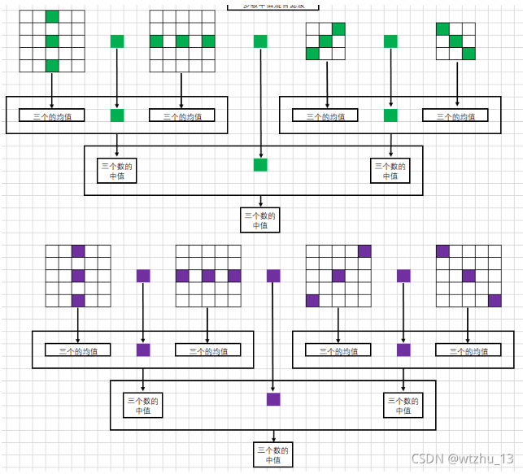

#### 多级中值有理混合滤波

##### 算法原理图

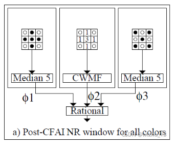

​	在原始数据的基础上给每个点分别赋予一个权重，然后在加权后的数据中取出中位值作为滤波后的值。

##### 算法流程

1. 求出’+'形和’X’形的窗口的中位值；

2. 对’+'形窗口再利用CWMF求出一个值，CWMF是WMF的一种特殊情况，就是只对中心点进行加权；

3. 对以上求出的三个参数用一下公式计算出一个新的值作为滤波后的值

   $`y(m, n)=\phi 2(m, n)+\frac{\phi 1(m, n)-2 * \phi 2(m, n)+\phi 3(m, n)}{h+k(\phi 1(m, n)-\phi 3(m, n))}`$

raw格式图像

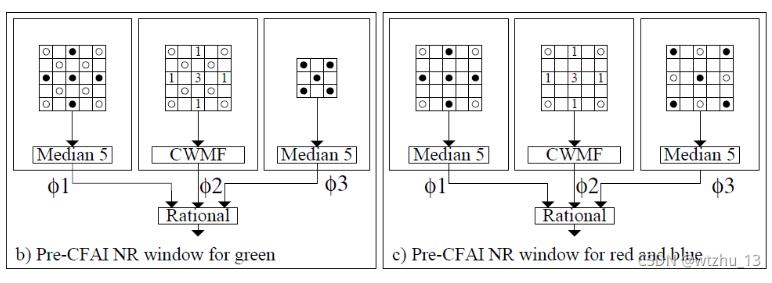

### 高斯滤波

​	**低通滤波** :图像平滑的效果

​	**高通滤波** :图像锐化,突出图像的细节特征,增强图像模糊的边缘

#### 高斯滤波的具体思路	

- 使用与中心像素的距离，通过高斯函数来计算该点的权重；
- 将所有点的权重求出来后对权重进行归一化处理；
- 利用加权平均的方式计算滤波后的像素值；
- 邻域窗口遍历图像，重复上述操作。

#### 高斯低通滤波

##### 一维离散系统:高斯低通滤波器

- $`h[k]={1,2,1}`$

##### 二维离散系统:高斯低通滤波器

- $`h(m, n)=\left[\begin{array}{lll}1 & 2 & 1 \\ 2 & 4 & 2 \\ 1 & 2 & 1\end{array}\right]*\frac{1}{16}`$

#### 结果缺陷

​	边缘信息保留仍然比较欠缺。

### 双边滤波

#### 算法公式

$`\begin{aligned} I_{\mathbf{p}}^{\mathrm{bf}} &=\frac{1}{W_{\mathbf{p}}^{\mathrm{bf}}} \sum_{\mathbf{q} \in \mathcal{S}} G_{\sigma_{\mathrm{s}}}(|\mathbf{p}-\mathbf{q}|) G_{\sigma_{\mathrm{r}}}\left(\left|I_{\mathbf{p}}-I_{\mathbf{q}}\right|\right) I_{\mathbf{q}} \\ \text { with } \quad W_{\mathbf{p}}^{\mathrm{bf}} &=\sum_{\mathbf{q} \in \mathcal{S}} G_{\sigma_{\mathrm{s}}}(|\mathbf{p}-\mathbf{q}|) G_{\sigma_{\mathrm{z}}}\left(\left|I_{\mathbf{p}}-I_{\mathbf{q}}\right|\right) \end{aligned}`$

#### 算法原理

​	双边滤波由两个高斯权重叠加而来，前面$`|p-q|`$是高斯滤波中使用的距离权重,后面的$`|I_p-I_q|`$是像素值的高斯分布权重.去噪时需要相似区域有更大的贡献,不相似的给予小的权重,而同侧相差小就会有一个很大的权重.从而起到保留边缘的目的.

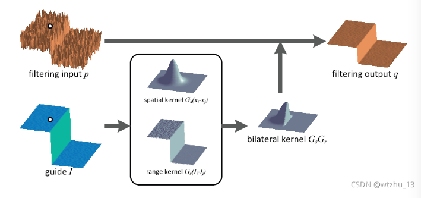

​	当对白点位置进行滤波操作的时候,同侧像素差别较小会有一个大权重,而另一侧差别很大权重也就很小,二者结合后就相当于高斯滤波取一侧,然后利用这个核进行滤波操作.

### [NLM](#1.1)

#### 具体算法思路

​	1、遍历整幅图像；
​	2、针对每一个点定义一个滑动窗口，降噪的时候利用该窗口中的所有点的信息计算；
​	3、定义一个邻域范围，用来计算像素块的差异；
​	4、遍历滑动窗口中的点，求每个点的邻域范围和当前点的邻域范围的像素差值的平方和，并利用该值计算一个权重；
​	5、遍历完滑动窗口中的所有点后，滑动窗口中的每个点都有一个权重，对权重进行归一化处理；
​	6、得到归一化处理后的权重通过加权平均的方式计算出当前点的新的像素值；

​	原始代码中没有对图像进行扩充操作，在边界时，通过改变滑动窗口的大小和领域的半径来处理。

##  BM3D图像去噪算法详解

​	通过相似判定找到与参考块相近的二维图像块，并将相似块按照组合成三维群组，对三维群组进行协同滤波处理，再将处理结果聚合到原图像块的位置。类似于之前说的NL-means，也是在图像中寻找相似块的方式进行滤波。

BM3D算法主要分两步(按collaborative filtering划分)：

一、 在协同过滤阶段使用 临界点

​    1、分组：在image图像中寻找相似块，使用临界点定义相似性，进而堆叠不同的块；

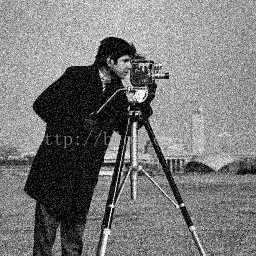

​    1.2、协同过滤：对每一个相似分组块做3D线性变换，变换谱的收缩，最后在逆变换得到基本估计块；

​    1.3、聚合：因为前面每一个patch在3D block逆变换后对应的多个，经验的做法是直接平均所有的块，但更建议根据得到的patch质量，赋予不同的权值加权平均。此时的聚合是一个特殊的平均过程，类似于NNLM方法，利用图片的冗余性恢复含噪图片。 

二、和步骤一类似，如下图，不同之处有两点：

​    **D1**、比较过滤后的图像块而不是原始图像块 

​    **D2**、使用Wiener滤波处理新的3D 组，而不是 临界值

​     在实验中发现步骤二会恢复出更多的图像细节部分，提高去噪性能。

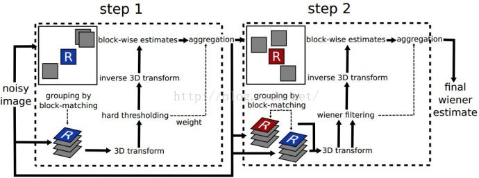

​	综合便是：

	1) 找到与给定图像块相似的图像块并将它们分组在一个 3D 块中
	2) 3D块的3D线性变换；
	3) 变换谱系数的收缩；
	4）逆3D变换

​	BM3D的一个形象比喻……

​	通过sklearn.restoration.estimte_sigma()函数估计sigma，直觉感受在浙江档案上的效果不是很好。

​	使用用python复现的代码来看对单色图的效果还不错。彩色图嘛，马马虎虎，还是DNN的效果好些。
 

#　未完待续 细节还可以补充